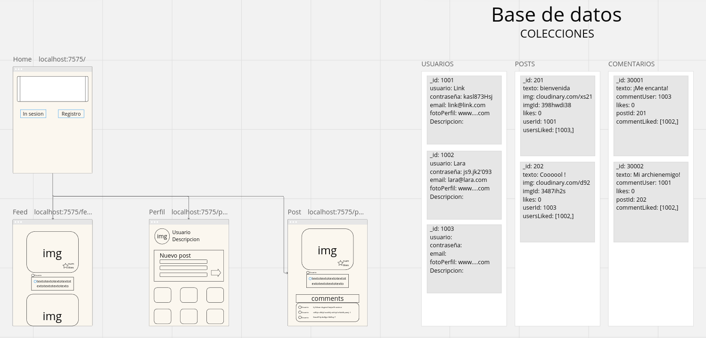

# Arcadeverso

Arcadeverso es una sencilla Red Social en la que los personajes más famosos y queridos de los videojuegos interactuan entre ellos como si del mundo real se tratara.

# Proyecto MVC (Modelo-Vista-Controlador)
Este es un proyecto diseñado como una práctica para entender los conceptos del patrón de diseño Modelo-Vista-Controlador (MVC). El proyecto consiste en una aplicación web sencilla que implementa este patrón para separar la lógica, la presentación y el control de la aplicación.

## Tecnologías principales utilizadas

- JavaScript
- Node.js
- Express.js
- MongoDB
- Passport.js
- EJS (Embedded JavaScript)

## Lluvia de ideas inicial

## Demostración

